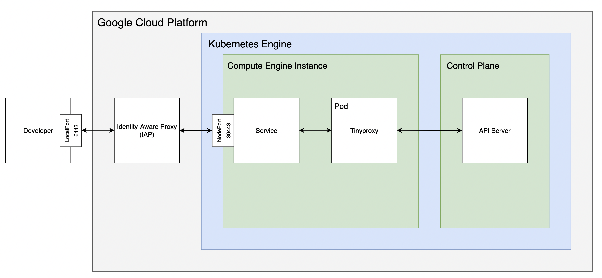

# gke-iap

A gcloud wrapper to access GKE private cluster through IAP.




## Requirements

The following software must be installed:

* [gcloud](https://cloud.google.com/sdk/docs/install)
* [kubectl](https://kubernetes.io/docs/tasks/tools/#kubectl)


## Usage

```sh
gke-iap: a gcloud wrapper to access GKE private cluster through IAP

Usage: gke-iap [Options...]
Options:
    -p,   -project              The Google Cloud project ID to use for this invocation.
    -c,   -cluster              Name of the GKE cluster. Default: default.
    -ip,  -instance-port        The number of the GKE instance's port to connect to.
                                Default: 30443.
    -lp,  -local-port           The number of the port on which should listen for
                                connections that should be tunneled. Default: 6443.
    -v,   -version              Show version information.
    -h,   -help                 Show help message.
```


## Installation

The latest version can be downloaded from the [release page](https://github.com/rantanevich/gke-iap/releases).


## Example

Authorize `gcloud` to access the GCP Platform

```sh
gcloud auth login
```

Setup `kubectl` context and start IAP-tunnel to the GKE cluster

```sh
$ gke-iap -p my-project -c my-cluster
```


## Links

- [Creating GKE private clusters with network proxies for controller access ](https://cloud.google.com/architecture/creating-kubernetes-engine-private-clusters-with-net-proxies)
- [Tinyproxy](http://tinyproxy.github.io/)


## To Do

* Use default project `gcloud config get project` if unset
* Unit tests
